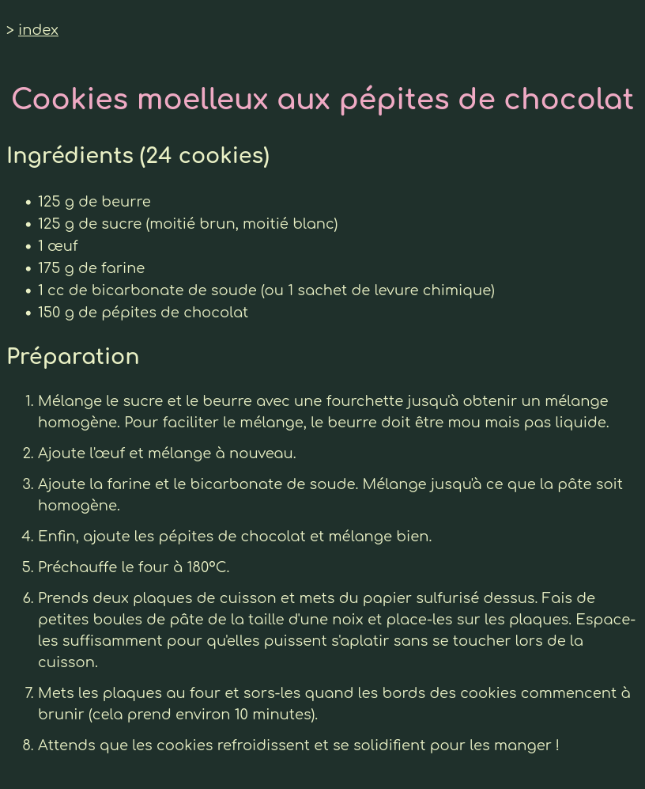

A minimalist website in which I gather my recipes and some meal ideas for my personnal use.

This is my solution to the [Recipes](https://www.theodinproject.com/lessons/foundations-recipes) project from The Odin Project.

# TODO

- [ ] Add more recipes (sauce au poivre)

- [ ] Use a static website generator to generate pages of recipes

# Screenshots

